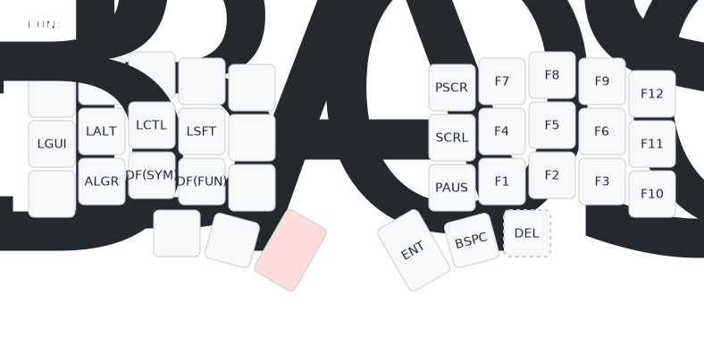
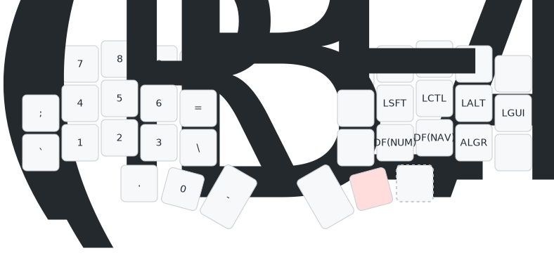

# 레이어 소개

제가 사용 하는 레이어를 소개합니다.  
미료쿠를 개조하다보니 이지경까지 되었습니다.

## 목차

- [레이어 소개](#레이어-소개)
  - [목차](#목차)
    - [기본 레이어](#기본-레이어)
    - [이동 레이어](#이동-레이어)
    - [기능 레이어](#기능-레이어)
    - [숫자 레이어](#숫자-레이어)
    - [특문 레이어](#특문-레이어)
    - [마우스 레이어-트랙볼 지원](#마우스-레이어-트랙볼-지원)
    - [마우스 레이어-트랙볼 미지원](#마우스-레이어-트랙볼-미지원)
    - [레이어 공통](#레이어-공통)

### 기본 레이어

-   QWERTY 기반 기본이 되는 레이어 입니다.
-   자주쓰는 `한/영` `CAPS LOCK` `_`키는 콤보로 구성하였습니다.[^1]  
    ~~한영키는 `Shift + Space`조합으로 설정되어 있으므로  
    사용시 변경이 필요할 수 있습니다.(이번 기회에 `Shift + Space`로 사용하심을 추천드립니다.)~~
-   트랙볼 사용 시 `Delete`키는 오른손 엄지 콤보키로 사용합니다.

### 이동 레이어

-   방향 관련 키를 누를 때 사용하는 네비게이션 레이어 입니다.

### 기능 레이어

-   기능 레이어 입니다. 별거 없습니다.

### 숫자 레이어

-   숫자 레이어입니다. 별거 없습니다.

### 특문 레이어

-   특수문자 레이어입니다. 별거 없습니다.

### 마우스 레이어-트랙볼 지원

-   Charybdis Nano용 마우스 레이어 입니다.
-   Z홀드 시 마우스 레이어를 사용하여 각종 마우스키 및 기타 기능키 사용이 가능합니다.
-   /(슬래시)홀드시 마우스 레이어를 사용하여 각종 마우스키 및 기타 기능키 사용이 가능합니다. 단, 드래그 스크롤 모드로 작동합니다.
-   좌측 KC_BTN2는 [탭-클릭] [홀드-스크롤모드]로 동작 합니다.

| 키코드     | 설명                   | WITH SHIFT             |
| :--------- | :--------------------- | :--------------------- |
| WINUP      | 창 위로 이동           | 창 위 모니터로 이동    |
| WINLT      | 창 좌측으로 이동       | 창 좌측 모니터로 이동  |
| WINDN      | 창 아래로 이동         | 창 아래 모니터로 이동  |
| WINRT      | 창 우측으로 이동       | 창 우측 모니터로 이동  |
| WINFLT     | 창 좌측 모니터로 이동  |
| WINFRT     | 창 우측 모니터로 이동  |
| LEFT DESK  | 데스크탑 좌측으로 이동 |
| RIGHT DESK | 데스크탑 우측으로 이동 |
| NEW DESK   | 데스크탑 생성          |
| DEL DESK   | 데스크탑 삭제          |
| DPI_MOD    | DPI 상승               | DPI 하강               |
| S_D_MOD    | 스나이핑 모드 DPI 상승 | 스나이핑 모드 DPI 하강 |
| SNIPING    | 스나이핑 모드          |

### 마우스 레이어-트랙볼 미지원

-   일반용 마우스 레이어 입니다.
-   Z, /(슬래시)홀드 시 마우스 레이어를 사용하여 각종 마우스키 및 기타 기능키 사용이 가능힙니다.

| 키코드     | 설명                   | WITH SHIFT     |
| :--------- | :--------------------- | :------------- |
| MS_UP      | 마우스 위로 이동       | 휠 위로 이동   |
| MS_LT      | 마우스 좌로 이동       | 휠 좌로 이동   |
| MS_DN      | 마우스 아래로 이동     | 휠 아래로 이동 |
| MS_RT      | 마우스 우로 이동       | 휠 우로 이동   |
| WINFLT     | 창 좌측 모니터로 이동  |
| WINFRT     | 창 우측 모니터로 이동  |
| LEFT DESK  | 데스크탑 좌측으로 이동 |
| RIGHT DESK | 데스크탑 우측으로 이동 |
| NEW DESK   | 데스크탑 생성          |
| DEL DESK   | 데스크탑 삭제          |

### 레이어 공통

-   각 레이어 별로 존재하는 TD(REBOOT)키는 부트로더 진입 키 이며 더블 탭 할 경우 작동합니다.
-   각 레이어 별로 존재하는 DF(레이어명)키는 기본 레이어를 변경하는 키 입니다.  
    한손 사용시 사용 할 수 있습니다.  
    (EX: 왼손으로는 키보드, 오른손으로는 마우스 사용시 숫자 입력을 위해  
    왼손을 사용하여 숫자 레이어로 변경한 뒤 숫자 입력 가능)
-   DF(BASE) 키는 본래 기본 레이어로 돌려 놓기 위한 키입니다.

[^1]:
    쿼리는 대문자/언더바, 소스는 소/대문자, 주석은 한글  
    어쩔 수 없이 골고루 써야하는 한국인 개발자의 숙명입니다.
